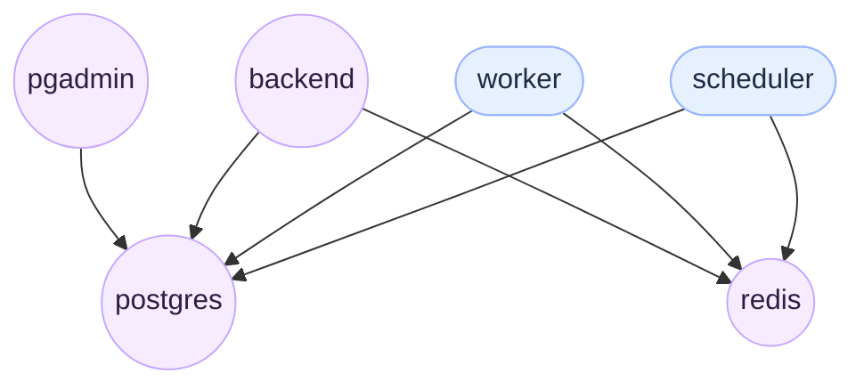

# System Architecture Overview

## Summary
- Total services: 6
- Total connections: 7

## Services
| Name | Image | Exposed | Ports |
| --- | --- | --- | --- |
| postgres | postgres:15-alpine | Yes | 5432:5432 |
| pgadmin | dpage/pgadmin4:latest | Yes | 8080:80 |
| redis | redis:7-alpine | Yes | 6380:6379 |
| backend | None | Yes | 5000:5000 |
| worker | None | No | None |
| scheduler | None | No | None |

## Dependencies
- pgadmin 2 postgres
- backend 2 postgres
- backend 2 redis
- worker 2 postgres
- worker 2 redis
- scheduler 2 postgres
- scheduler 2 redis

## Exposed Services
- postgres exposed on host port 5432
- pgadmin exposed on host port 8080
- redis exposed on host port 6380
- backend exposed on host port 5000

## Diagram

